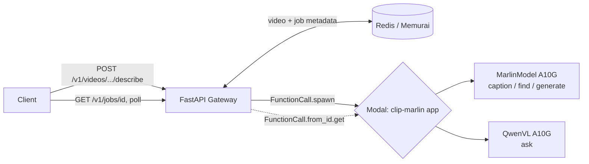

# Clip 🎬

**Ask questions of any video.** Self-hostable, open-weights video understanding platform built on [Marlin-2B](https://huggingface.co/NemoStation/Marlin-2B) and [Qwen3-VL-8B-Instruct](https://huggingface.co/Qwen/Qwen3-VL-8B-Instruct).

> **Status:** v0.1 — Milestone 1 chunk (a) shipped. Async job queue via Modal's native `FunctionCall.spawn` / `from_id`. All four endpoints (`/describe`, `/find`, `/summarise`, `/ask`) verified end-to-end. See `BUILD_LOG.md` for the full journey.

## What it does

- **Describe** a video → dense paragraph + scene/event breakdown with timestamps
- **Find** moments by natural language → `(start, end)` ranges
- **Summarise** long video → bullet-point chapters
- **Ask** open-ended questions → grounded answers via Qwen3-VL

## Models & routing

| Endpoint | Model | Why |
|---|---|---|
| `/describe`, `/find`, `/summarise` | **Marlin-2B** | Native temporal grounding, ~5 GB VRAM, runs cheap on an A10G |
| `/ask` | **Qwen3-VL-8B-Instruct** | Actual reasoning (Marlin is a captioner, can't answer "why" questions) |

Both classes live in one deployed Modal app (`clip-marlin`) and scale independently. TimeLens-8B is in the PRD roadmap for longer videos / precision temporal queries but is not deployed in v0.1.

## Architecture (as actually shipped)



- **Modal IS the job queue.** No Celery worker, no Docker Redis-as-broker. `submit_caption` etc. call `.spawn()`; `get_job` polls via `FunctionCall.from_id(object_id).get(timeout=0)`.
- **Redis (Memurai on Windows) holds metadata only** — video records and per-job context (which endpoint enqueued it, video duration, model that ran). 7-day TTL on jobs aligns with Modal's output retention.
- **Postgres + S3 are planned** for chunk (b) — currently videos live on `/tmp/clip-storage` and metadata is Redis-backed (stopgap, single-box).

See [`PRD.md`](./PRD.md) for the full product spec and [`BUILD_LOG.md`](./BUILD_LOG.md) for build history.

## Quickstart (Windows + Modal backend)

Tested on Windows 11 + PowerShell. Linux/macOS works the same way; substitute the Memurai install for `redis-server` from your package manager.

### Prerequisites

1. **Python 3.10+** and **ffmpeg** (yt-dlp dependency).
2. **Memurai Developer Edition** (Windows-native Redis): https://www.memurai.com/get-memurai → MSI install → auto-runs as a Windows service on port 6379.
3. **Modal account + CLI**: `pip install modal && modal setup`.
4. **HuggingFace gated access** to Marlin-2B (accept terms on the model card).
5. **Modal secret** `huggingface-secret` containing `HF_TOKEN=hf_xxx`.

### Setup

```powershell
# 1. Install deps
pip install -r requirements.txt

# 2. Deploy Marlin + Qwen3-VL to Modal (one-time, ~5 min)
modal deploy modal_app.py

# 3. Start the gateway. Run detached so terminal focus can't kill it.
$env:CLIP_BACKEND="modal"
Start-Process uvicorn -ArgumentList "main:app --host 0.0.0.0 --port 8000" `
    -RedirectStandardError uvicorn.err.log -PassThru |
    Select-Object -ExpandProperty Id |
    Out-File uvicorn.pid

# Sanity check
curl.exe http://localhost:8000/healthz
# → {"status":"ok","version":"0.1.2"}
```

### Try it

```powershell
# Ingest a video (URL or upload)
$r = Invoke-RestMethod -Method POST -Uri http://localhost:8000/v1/videos/from-url `
    -ContentType application/json `
    -Body (@{ url = "https://www.youtube.com/watch?v=bY8A66LjGBg" } | ConvertTo-Json)
$VIDEO_ID = $r.video_id

# Enqueue describe
$job = Invoke-RestMethod -Method POST -Uri "http://localhost:8000/v1/videos/$VIDEO_ID/describe"
$JOB_ID = $job.job_id

# Poll to SUCCESS (~30-90s cold start, ~10-20s warm)
while ($true) {
    $r = Invoke-RestMethod "http://localhost:8000/v1/jobs/$JOB_ID"
    Write-Host (Get-Date -Format HH:mm:ss) $r.status
    if ($r.status -in @("SUCCESS","FAILURE")) { $r | ConvertTo-Json -Depth 6; break }
    Start-Sleep 3
}
```

Or just open `index.html` in a browser, paste a URL, click Describe.

**URL ingestion note:** yt-dlp supports YouTube, Vimeo, X, TikTok, Instagram, and ~1000 other sites. YouTube's ToS technically restricts downloading; use accordingly.

### Stopping the gateway

```powershell
Stop-Process -Id (Get-Content uvicorn.pid)
```

## API

```
POST /v1/videos                       upload (multipart) — returns {video_id, duration_seconds, ...}
POST /v1/videos/from-url              JSON {url: "..."} — returns the same shape
GET  /v1/videos/{id}                  metadata

POST /v1/videos/{id}/describe         → {job_id, status: "PENDING", status_url}
POST /v1/videos/{id}/find             body: {query: "..."}
POST /v1/videos/{id}/summarise        body: {style: "bullets"}
POST /v1/videos/{id}/ask              body: {question: "..."}

GET  /v1/jobs/{id}                    → {job_id, status, result, error}
                                        status ∈ PENDING|STARTED|SUCCESS|FAILURE
                                        result shape varies by endpoint (DescribeResponse | FindResponse | ...)
```

Force a specific model via `?model=marlin-2b|qwen3-vl-8b` on any endpoint.

## Project layout

```
clip/
├── main.py                FastAPI gateway, endpoints, GET /v1/jobs parser dispatch
├── inference.py           ModalVLM wrappers — sync (.remote) + spawn (.spawn) variants
├── modal_app.py           Modal app definition: MarlinModel + QwenVL classes (A10G)
├── store.py               Redis-backed metadata + job records
├── routing.py             Model selection + output parsing (Marlin tags, HH:MM:SS, find spans)
├── sampling.py            ffmpeg frame sampling for the prompted-generate fallback path
├── downloader.py          yt-dlp wrapper for URL ingestion
├── schemas.py             Pydantic request/response models incl. job envelopes
├── constants.py           ModelChoice enum + HF repo mapping
├── index.html             Minimal HTML/JS frontend with async polling loop
├── PRD.md                 Product requirements doc
├── BUILD_LOG.md           Dated session-by-session build journal (decisions + dead ends)
└── requirements.txt
```

## Roadmap

See [`PRD.md § 8`](./PRD.md#8-build-plan). Current state:

- ✅ Milestone 0 — Spike
- 🚧 Milestone 1
  - ✅ Async job queue (Modal-native — chunk a)
  - ⏳ S3-compatible storage + Postgres metadata (chunk b)
  - ⏳ Next.js frontend with video player + timestamp-jump (chunk c)
- ⏳ Milestone 2 — TimeLens-8B, webhooks, API key auth, HF Spaces demo

## Credits & licences

- [Marlin-2B](https://huggingface.co/NemoStation/Marlin-2B) — Apache 2.0
- [Qwen3-VL-8B-Instruct](https://huggingface.co/Qwen/Qwen3-VL-8B-Instruct) — Apache 2.0 (Alibaba)
- [TimeLens-8B](https://huggingface.co/TencentARC/TimeLens-8B) (planned) — custom; check model card
- Papers: [Marlin (arxiv:2501.00513)](https://arxiv.org/abs/2501.00513) · [TimeLens (arxiv:2512.14698)](https://arxiv.org/abs/2512.14698)
