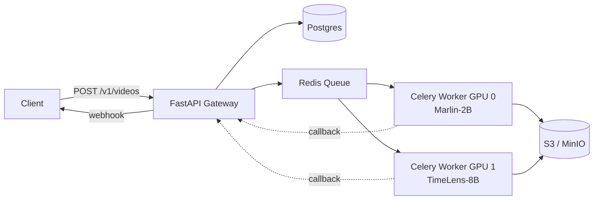

# Clip 🎬

**Ask questions of any video.** Self-hostable, open-weights video understanding platform built on [Marlin-2B](https://huggingface.co/NemoStation/Marlin-2B) and [TimeLens-8B](https://huggingface.co/TencentARC/TimeLens-8B).

## What it does

- **Describe** a video → dense paragraph + scene/event breakdown with timestamps
- **Find** moments by natural language → `(start, end)` ranges
- **Summarise** long video → chapters or bullets
- **Ask** open-ended questions → grounded answers

## Why these models

| | Marlin-2B | TimeLens-8B | Gemini-2.5-Flash |
|---|---|---|---|
| Params | 2B | 8B | proprietary |
| VRAM (bf16) | ~5 GB | ~18 GB | n/a |
| Dense captioning (DREAM-1K) | tops CaReBench; sits between Tarsier-34B and Gemini-1.5-Pro | strong | strong |
| Temporal grounding (TimeLens-Bench) | beats Qwen2.5-VL-7B | SOTA open-source, surpasses GPT-5 | beaten by TimeLens-8B |
| Self-hostable | ✅ | ✅ | ❌ |
| Cost per min of video (self-hosted A10) | ~$0.005 | ~$0.02 | ~$0.30 (API) |

**Default routing:**
- Short videos (<10 min) → Marlin-2B
- Long videos OR precise temporal queries → TimeLens-8B
- Force with `?model=marlin-2b` or `?model=timelens-8b`

## Architecture



See [`docs/PRD.md`](./docs/PRD.md) for the full product spec.

## Quickstart (local, single GPU)

### Requirements
- Linux/macOS with NVIDIA GPU (8+ GB VRAM for Marlin, 24+ GB for TimeLens)
- Python 3.11+
- ffmpeg
- CUDA 12.1+

### 1. Backend

```bash
cd backend
python -m venv .venv && source .venv/bin/activate
pip install -r requirements.txt

# First run downloads the model (~5 GB)
uvicorn main:app --reload --port 8000
```

### 2. Try it (curl)

```bash
# Option A: upload a local file
VIDEO_ID=$(curl -s -F "file=@sample.mp4" http://localhost:8000/v1/videos | jq -r .video_id)

# Option B: pull from a URL (YouTube, Vimeo, X, TikTok, ~1000 sites, or any direct .mp4)
VIDEO_ID=$(curl -s -X POST http://localhost:8000/v1/videos/from-url \
  -H "Content-Type: application/json" \
  -d '{"url": "https://www.youtube.com/watch?v=dQw4w9WgXcQ"}' | jq -r .video_id)

# Describe it
curl -X POST http://localhost:8000/v1/videos/$VIDEO_ID/describe | jq

# Find a moment
curl -X POST http://localhost:8000/v1/videos/$VIDEO_ID/find \
  -H "Content-Type: application/json" \
  -d '{"query": "when does the person sit down"}' | jq
```

**URL ingestion note:** YouTube's ToS technically prohibits downloading. Self-host accordingly and require user accountability in your ToS for any URL submitted.

### 3. Frontend (optional)

```bash
cd frontend
# Just open index.html in a browser, or:
python -m http.server 5173
# → http://localhost:5173
```

## Deployment

### Option A: Modal (recommended for indie/dev)
~$0.60/hr for A10. See `deploy/modal_app.py` (TODO M1).

### Option B: HF Inference Endpoints
Push the Marlin-2B repo as an endpoint; point `MODEL_BACKEND=hf_endpoint` in env.

### Option C: Self-hosted A10/A100
Docker compose with one worker per GPU. See `deploy/docker-compose.yml` (TODO M1).

### GPU not available locally?
Marlin-2B runs on a free Colab T4 — see `notebooks/marlin_colab.ipynb` (TODO M1).
Or use Modal/RunPod/Vast.ai for ~$0.50/hr.

## Project layout

```
clip-video-analysis/
├── backend/                FastAPI + Celery + model inference
│   ├── main.py             API entrypoint
│   ├── inference.py        Marlin / TimeLens wrappers
│   ├── sampling.py         ffmpeg frame sampling
│   ├── routing.py          model selection logic
│   ├── schemas.py          Pydantic request/response models
│   └── requirements.txt
├── frontend/               Minimal HTML/JS client
│   └── index.html
├── docs/
│   └── PRD.md              Product requirements doc
└── README.md
```

## Roadmap

See [`docs/PRD.md` § 8](./docs/PRD.md#8-build-plan). Current: **Milestone 0 — Spike**.

## Credits & licences

- [Marlin-2B](https://huggingface.co/NemoStation/Marlin-2B) — Apache 2.0
- [TimeLens-8B](https://huggingface.co/TencentARC/TimeLens-8B) — custom (commercial use TBD; check model card)
- [Qwen3-VL](https://huggingface.co/Qwen) base — Apache 2.0 (Alibaba)
- Papers: [Marlin (arxiv:2501.00513)](https://arxiv.org/abs/2501.00513) · [TimeLens (arxiv:2512.14698)](https://arxiv.org/abs/2512.14698)
